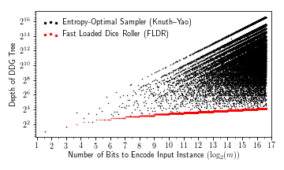
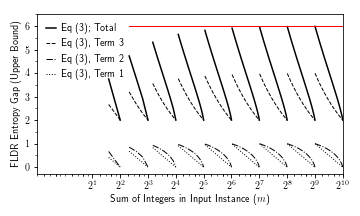
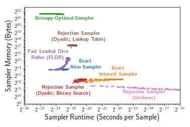
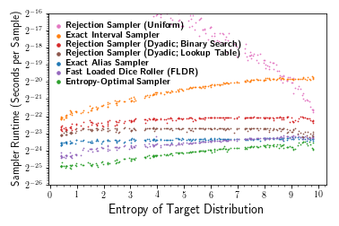
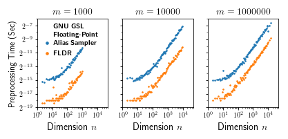

# The Fast Loaded Dice Roller -- Experiments

This repository contains the experiments from Section 6 of

> Feras A. Saad, Cameron E. Freer, Martin C. Rinard, and Vikash K. Mansinghka.
[The Fast Loaded Dice Roller: A Near-Optimal Exact Sampler for Discrete Probability Distributions](http://fsaad.mit.edu/assets/SFRM-FLDR-AISTATS-2020.pdf).
In AISTATS 2020: Proceedings of the 23rd International Conference on
Artificial Intelligence and Statistics, Proceedings of Machine Learning
Research 108, Palermo, Sicily, Italy, 2020.

The Fast Loaded Dice Roller (FLDR) is a fast algorithm for rolling an
n-sided die.  More specifically, given a list `L` of `n` integers
that sum to `m`, FLDR returns an integer `i` with probability `L[i]/m`.

In addition to FLDR (Alg 5. in the main paper), this repository contains
implementations of the following baseline exact sampling algorithms:

1. Entropy-optimal sampler from Knuth & Yao [1976].

2. Rejection sampler with uniform proposal (Alg. 1 in main paper).

3. Rejection sampler with dyadic proposal, using a lookup table (Alg. 2 in main paper).

4. Rejection sampler with dyadic proposal, using binary search (Alg. 3 in main paper).

5. Exact interval sampler from Han & Hoshi [1997], using the binary digit
   implementation from Devroye and Gravel [2015; Alg. 1].

6. Exact alias sampler from Walker [1977], using entropy-optimal uniform
   and Bernoulli sampling from Lumbroso [2013] and the one-table
   implementation from Vose [1993].

For reference implementations of FLDR in Python and C, please use the
stand-alone repository in
https://github.com/probcomp/fast-loaded-dice-roller, not the implementation
here.

## Installing

The C code for the main samplers are in the `c/` directory and the
supporting Python 3 libraries are in the the `src/` directory. Please use a
Python 3 virtual environment. To install the Python library run the
following command

    $ pip install -r requirements.txt
    $ pip install .

To build the C library run

    $ cd c && make all

## Tests

Run the following command in the shell

    $ ./check.sh

## Running the Experiments

The following instructions show how to reproduce Figures 2, 3, 4, and 5
from the main paper.

This software is tested on Ubuntu 16.04/18.04.  If you are using
Mac OS X, please use `gxargs` and `gstat` instead of `xargs` and `stat` in
`pipeline.sh` (for generating Figures 4 and 5).

### Figure 2

Run the notebook in
[experiments/notebooks/figure-2-sampler-sizes.ipynb](experiments/notebooks/figure-2-sampler-sizes.ipynb).

### Figure 3

Run the notebook in
[experiments/notebooks/figure-3-fldr-gap.ipynb](experiments/notebooks/figure-3-fldr-gap.ipynb).

### Figure 4

Run the following command

    $ cd experiments
    $ ./pipeline.sh '' run-all-memory-runtime 40001 1000

By default, all the CPUs on the machine will be used.  For a machine with
64 cores the command take around 3 minutes to run.  To limit the number of
CPUs to `n`, set the environment variable `export JOBS=n`.

Then run the notebook in
[experiments/notebooks/figure-4-sampler-comparison.ipynb](experiments/notebooks/figure-4-sampler-comparison.ipynb).

### Figure 5

Run the following command

    $ cd experiments
    $ ./pipeline.sh pp.mn.418 preprocess-initialize
    $ ./pipeline.sh pp.mn.418 preprocess-measure
    $ ./pipeline.sh pp.mn.418 preprocess-aggregate

By default, all the CPUs on the machine will be used.  For a machine with
64 cores the command take around 3 minutes to run.  To limit the number of
CPUs to `n`, set the environment variable `export JOBS=n`.

Then run the notebook in
[experiments/notebooks/figure-5-preprocessing-time.ipynb](experiments/notebooks/figure-5-preprocessing-time.ipynb).

## Citing

Please cite the following paper:

    @inproceedings{saad2020fldr,
    title           = {The Fast Loaded Dice Roller: A Near-optimal Exact Sampler for Discrete Probability Distributions},
    author          = {Saad, Feras A. and Freer, Cameron E. and Rinard, Martin C. and Mansinghka, Vikash K.},
    booktitle       = {AISTATS 2020: Proceedings of the 23rd International Conference on Artificial Intelligence and Statistics},
    volume          = 108,
    series          = {Proceedings of Machine Learning Research},
    address         = {Palermo, Sicily, Italy},
    publisher       = {PMLR},
    year            = 2020,
    keywords        = {random variate generation, sampling, discrete random variables},
    abstract        = {This paper introduces a new algorithm for the fundamental problem of generating a random integer from a discrete probability distribution using a source of independent and unbiased random coin flips. This algorithm, which we call the Fast Loaded Dice Roller (FLDR), has efficient complexity properties in space and time: the size of the sampler is guaranteed to be linear in the number of bits needed to encode the target distribution and the sampler consumes (in expectation) at most 6.5 bits of entropy more than the information-theoretically minimal rate, independently of the values or size of the target distribution. We present an easy-to-implement, linear-time preprocessing algorithm and a fast implementation of the FLDR using unsigned integer arithmetic. Empirical evaluations establish that the FLDR is 2x--10x faster than multiple baseline algorithms for exact sampling, including the widely-used alias and interval samplers. It also uses up to 10000x less space than the information-theoretically optimal sampler, at the expense of a less than 1.5x runtime overhead.},
    note            = {(To Appear)},
    }
